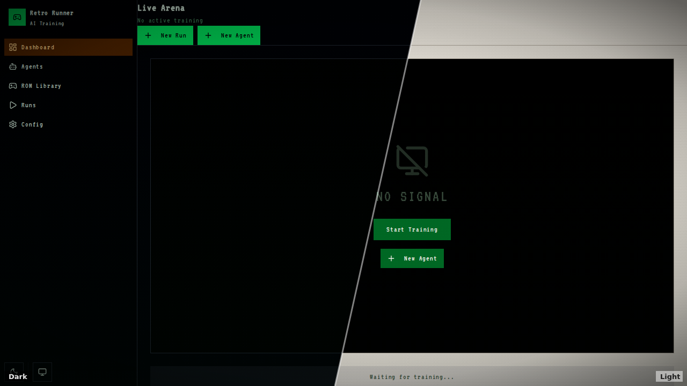
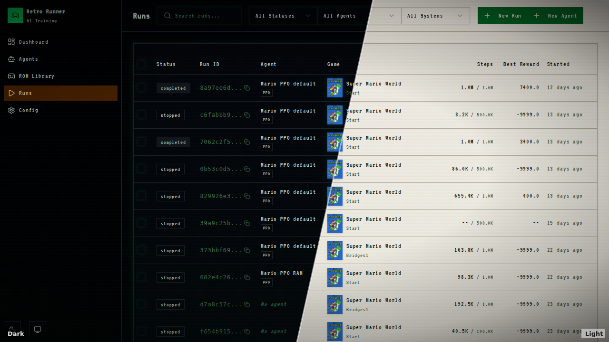
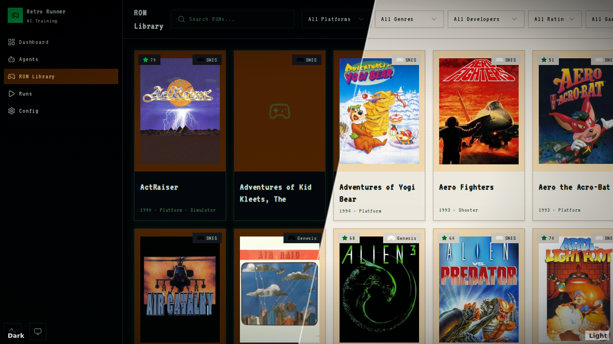
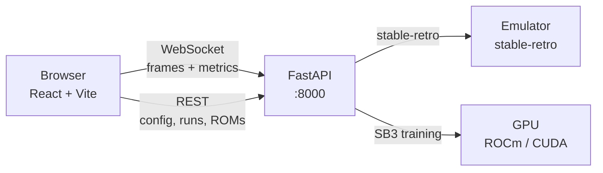
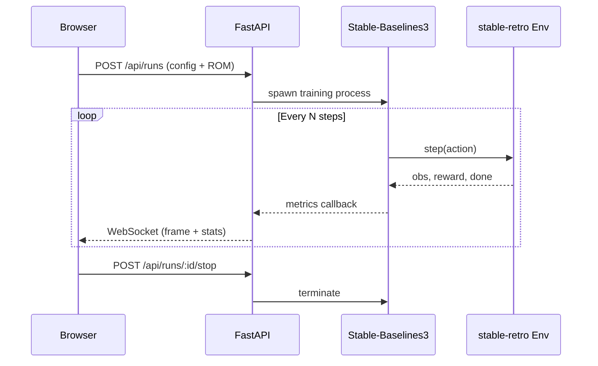
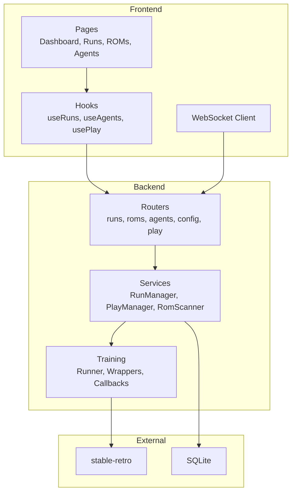

# Retro Runner

A local web app for training AI agents on retro games. You pick a ROM, dial in your hyperparameters, and watch the agent learn in real time — frames streaming live alongside reward curves, episode stats, and all the usual RL metrics.

Uses [stable-retro](https://github.com/Farama-Foundation/stable-retro) to run the games and [Stable-Baselines3](https://github.com/DLR-RM/stable-baselines3) to train the agents. Supports PPO, A2C, DQN, SAC, TD3, and DDPG out of the box.

## Screenshots

| Dashboard | Training Run | ROM Library |
|-----------|-------------|-------------|
|  |  |  |

## What's in it

- **Dashboard** with live frame rendering and training metrics
- **ROM library** that scans your stable-retro install for available games
- **Run management** — start, stop, and compare training runs
- **Agent profiles** for organizing trained models
- **Real-time WebSocket streaming** of game frames and stats
- **GPU accelerated** training (AMD ROCm and NVIDIA CUDA)
- **Brutalist retro UI** with CRT scanline effects and a pixel font, because why not

## Architecture

The whole thing runs locally. One server, one port in production.



In production, the React frontend gets built and served by FastAPI directly. In dev mode, Vite runs its own server with hot reload and proxies API calls to the backend.

### Training flow



### Data flow



## Getting started

You'll need Python 3.10+, Node.js, and pnpm.

```bash
# Install dependencies (both JS and Python)
pnpm setup

# Drop your ROM files into packages/roms/, then import them
pnpm roms:import

# Optional: set up GPU acceleration
pnpm setup:gpu
```

### IGDB API (optional)

The ROM library can pull game cover art and metadata from [IGDB](https://www.igdb.com/). This is optional — everything works without it, you just won't see thumbnails.

To enable it, create a free Twitch developer app at [dev.twitch.tv/console](https://dev.twitch.tv/console) and enter the Client ID and Client Secret on the Config page in the app.

## Running it

```bash
# Production mode — builds the frontend if anything changed, serves on :8000
pnpm start

# Dev mode — Vite dev server + FastAPI with hot reload
pnpm dev:all
```

## Project layout

```
apps/
  web/            React + Vite frontend
  api/            FastAPI backend, training logic, WebSocket handlers
    src/
      training/   RL training runner, wrappers, callbacks
      routers/    API endpoints
      services/   Run management, emulator control
packages/
  stable-retro/   Emulator library (git submodule)
  roms/           Your ROM files (gitignored)
scripts/          Setup, GPU config, and launch scripts
```

## Commands

| Command | What it does |
|---|---|
| `pnpm start` | Build + serve the full app on :8000 |
| `pnpm dev:all` | Dev mode with hot reload |
| `pnpm build` | Build just the frontend |
| `pnpm lint` | Lint web and API |
| `pnpm typecheck` | Typecheck web and API |
| `pnpm setup:gpu` | Configure GPU environment |

## Built with

- [stable-retro](https://github.com/Farama-Foundation/stable-retro) — multi-platform game emulation
- [Stable-Baselines3](https://github.com/DLR-RM/stable-baselines3) — RL algorithm implementations
- [Gymnasium](https://github.com/Farama-Foundation/Gymnasium) — RL environment interface
- [FastAPI](https://github.com/tiangolo/fastapi) — async Python backend
- [React](https://react.dev) + [Vite](https://vite.dev) — frontend
- [Tailwind CSS](https://tailwindcss.com) + [Radix UI](https://www.radix-ui.com) — styling and components
- [Recharts](https://recharts.org) — training metric charts
- [TanStack Router](https://tanstack.com/router) + [TanStack Query](https://tanstack.com/query) — routing and data fetching
